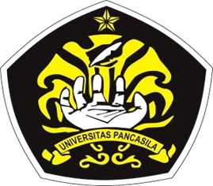

# TUGAS ETIKA PROFESI - KELOMPOK 09  
## Analisis Kasus: Boeing 737 MAX MCAS - Kegagalan Software pada Sistem Kritis

Dokumen ini disusun untuk memenuhi **Tugas Mata Kuliah Etika Profesi (A)**.

---

## Informasi Akademik
- **Dosen Pengampu**: Adi Wahyu Pribadi, S.Si., M.Kom  
- **Instansi**: Universitas Pancasila, Fakultas Teknik, S1 Teknik Informatika  
- **Tahun**: 2026  

  

---

## Anggota Kelompok 9

| Nama                        | NPM        |
|-----------------------------|------------|
| Ridwan Odi Nugroho         | 4524210089 |
| Ririn Verdawati            | 4524210090 |
| Nur Inayah Yusrizal        | 4524210117 |
| Maria Natalia Alyssa Beli  | 4524210133 |

---

## Daftar Isi

- [Bab I - Deskripsi Kasus](bab1-deskripsi-kasus.md)
- [Bab II - Fokus Analisis](bab2-fokus-analisis.md)
- [Bab III - Analisis Etika](bab3-analisis-etika.md)
- [Bab IV - Kesimpulan](bab4-kesimpulan.md)
- [Bab V - Daftar Pustaka](bab5-daftar-pustaka.md)

---

# BAB I
## Deskripsi Kasus

Dua kecelakaan penerbangan besar yang melibatkan pesawat Boeing 737 MAX terjadi dalam kurun waktu kurang dari lima bulan, yaitu Lion Air Flight 610 pada 29 Oktober 2018 dan Ethiopian Airlines Flight 302 crash pada 10 Maret 2019. Kedua insiden ini menewaskan total 346 orang dan menimbulkan perhatian besar dari dunia internasional.

Penerbangan Lion Air JT610 lepas landas dari Jakarta menuju Pangkal Pinang sebelum akhirnya jatuh di perairan Laut Jawa sekitar 13 menit setelah lepas landas. Sementara itu, Ethiopian Airlines ET 302 yang berangkat dari Addis Ababa menuju Nairobi mengalami kecelakaan sekitar 6 menit setelah lepas landas di wilayah dekat Bishoftu, Ethiopia.

Departemen Kehakiman Amerika Serikat pada Selasa (14/5/2024) menyatakan bahwa Boeing dapat dituntut atas kecelakaan Lion Air JT 610 dan Ethiopian Airlines ET302 yang menewaskan total 346 orang.

| Detail        | Lion Air JT610                       | Ethiopian ET302                  |
|---------------|--------------------------------------|----------------------------------|
| Tanggal       | 29 Oktober 2018                      | 10 Maret 2019                    |
| Lokasi        | Laut Jawa, dekat Karawang, Indonesia | Dekat Addis Ababa, Ethiopia      |
| Korban Jiwa   | 189 orang                            | 157 orang                        |
| Penumpang     | 181 orang                            | 149 orang                        |
| Crew          | 8 orang (2 pilot + 6 crew cabin)     | 8 orang (2 pilot + 6 crew cabin) |
| Waktu Terbang | 13 menit setelah lepas landas        | 6 menit setelah lepas landas     |

### Lion Air Flight 610 crash
Setelah lepas landas, pilot melaporkan masalah pada sistem kontrol penerbangan. Pesawat mengalami perubahan ketinggian (naik–turun) secara tidak stabil dan kesulitan dikendalikan. Data penerbangan menunjukkan hidung pesawat berulang kali terdorong ke bawah oleh sistem otomatis, hingga akhirnya pesawat jatuh ke Laut Jawa.

### Ethiopian Airlines Flight 302 crash
Beberapa menit setelah lepas landas, pilot melaporkan kesulitan mengendalikan pesawat dan meminta izin kembali ke bandara. Pesawat mengalami pergerakan tidak stabil dan penurunan tajam (nose dive) sebelum akhirnya jatuh di daratan dekat Bishoftu.

---

# BAB II
## Fokus Analisis

### 1. Kompromi Engineering vs Tekanan Bisnis

Pada kasus ini, terjadi benturan antara keputusan teknis (engineering) dengan kepentingan bisnis perusahaan.

#### Secara engineering, sistem MCAS seharusnya:
- Menggunakan lebih dari satu sensor (redundansi) untuk validasi data  
- Memiliki fail-safe mechanism (sistem aman jika terjadi error)  
- Memberikan informasi yang cukup ke pilot  

#### Tekanan Bisnis:
- Boeing ingin cepat bersaing dengan Airbus (khususnya A320neo)  
- Desain diubah seminimal mungkin agar pilot tidak perlu pelatihan tambahan  
- MCAS dibuat “diam-diam” tanpa penjelasan detail ke pilot  

#### Akibat:
- MCAS hanya bergantung pada 1 sensor (single point of failure)  
- Tidak ada validasi silang antar sensor  
- Informasi sistem tidak dijelaskan dengan jelas ke pilot  

Ketika sensor error:
- Sistem membaca kondisi yang salah  
- MCAS otomatis menurunkan hidung pesawat  
- Pilot kesulitan mengendalikan situasi  

---

### 2. Whistleblowing

Whistleblowing merupakan tindakan seseorang dalam organisasi untuk mengungkapkan informasi terkait pelanggaran, kesalahan, atau praktik yang berpotensi membahayakan kepada pihak internal maupun eksternal yang berwenang. Dalam konteks kasus Boeing 737 MAX, whistleblowing menjadi aspek penting karena adanya dugaan bahwa beberapa pihak internal telah mengetahui potensi risiko dari sistem MCAS sebelum terjadinya kecelakaan.
Dalam investigasi yang dilakukan setelah kecelakaan, ditemukan bahwa terdapat karyawan Boeing yang menyampaikan kekhawatiran terkait desain MCAS dan kurangnya transparansi informasi kepada pilot. Namun, informasi tersebut tidak ditindaklanjuti secara memadai oleh manajemen. Selain itu, terdapat indikasi bahwa tekanan untuk mempercepat sertifikasi dan produksi pesawat membuat suara-suara kritis dari internal organisasi tidak mendapatkan perhatian yang semestinya.

Peran whistleblower sangat penting dalam sistem safety-critical karena mereka dapat menjadi “garis pertahanan terakhir” dalam mencegah terjadinya kegagalan sistem. Dengan melaporkan potensi bahaya sejak dini, organisasi memiliki kesempatan untuk melakukan evaluasi dan perbaikan sebelum risiko tersebut berkembang menjadi kecelakaan.

Namun, dalam praktiknya, whistleblowing sering menghadapi berbagai hambatan, seperti:
- Takut terhadap tekanan atau sanksi dari perusahaan
- Budaya organisasi yang tidak terbuka terhadap kritik
- Kurangnya perlindungan bagi pelapor (whistleblower)
- Adanya konflik kepentingan antara keselamatan dan target bisnis

Dalam kasus Boeing, kurang optimalnya mekanisme whistleblowing dan tidak adanya tindak lanjut yang serius terhadap laporan internal menunjukkan lemahnya budaya keselamatan (safety culture) dalam organisasi. Hal ini berkontribusi pada tidak terdeteksinya risiko secara lebih awal.

Oleh karena itu, penting bagi perusahaan, khususnya yang bergerak di bidang teknologi dan transportasi, untuk:
- Menyediakan saluran whistleblowing yang aman dan anonim
- Memberikan perlindungan hukum bagi pelapor
- Menindaklanjuti setiap laporan secara objektif dan transparan
- Membangun budaya organisasi yang mengutamakan keselamatan
Dengan adanya sistem whistleblowing yang efektif, potensi kegagalan sistem seperti pada kasus Boeing 737 MAX dapat di minimalkan, sehingga keselamatan pengguna dapat lebih terjamin.

---

### 3. Tanggung Jawab Developer pada Sistem Safety-Critical

Dalam sistem safety-critical, developer memiliki tanggung jawab besar karena kesalahan kecil dapat menyebabkan dampak fatal seperti kecelakaan dan kehilangan nyawa. Hal ini terlihat pada kasus Lion Air Flight 610 crash, di mana kegagalan sistem berkontribusi terhadap kecelakaan.
Menurut Komite Nasional Keselamatan Transportasi (KNKT) dalam laporan investigasi Lion Air JT610, sistem MCAS bergantung pada satu sensor saja tanpa validasi dari sensor lain, sehingga meningkatkan risiko kesalahan sistem ketika sensor tersebut mengalami gangguan. Hal ini menunjukkan bahwa developer tidak menerapkan prinsip redundansi dalam sistem yang seharusnya menjadi standar pada sistem safety-critical.

Selain itu, menurut Badan Nasional Sertifikasi Profesi (BNSP), dalam praktik rekayasa perangkat lunak, seorang developer wajib menjunjung tinggi keselamatan, keandalan sistem, serta tanggung jawab etika profesional dalam setiap pengembangan teknologi, terutama yang berkaitan dengan keselamatan manusia. Artinya, developer tidak hanya bertanggung jawab secara teknis, tetapi juga harus memastikan bahwa sistem yang dibuat aman digunakan dalam berbagai kondisi, termasuk kondisi kegagalan.

Berdasarkan kedua sumber tersebut, tanggung jawab developer dalam sistem safety-critical meliputi:
- Mengutamakan keselamatan dibandingkan kepentingan bisnis
- Menerapkan redundansi (lebih dari satu sensor atau sumber data)
- Menyediakan mekanisme fail-safe saat terjadi error
- Memberikan informasi yang jelas kepada pengguna (pilot)
- Melakukan pengujian sistem secara menyeluruh
- Menjaga etika profesional dalam pengambilan keputusan teknis

Dengan demikian, dapat disimpulkan bahwa kegagalan dalam memenuhi tanggung jawab tersebut dapat menyebabkan sistem menjadi tidak aman dan berpotensi menimbulkan kecelakaan fatal.

---

# BAB III
## Analisis Etika, Moral, dan Etika Profesi
###
Analisis ini bertujuan untuk membedakan secara jelas antara moral (nilai pribadi), etika umum (prinsip sosial), dan etika profesi (standar formal dalam bidang pekerjaan), serta mengevaluasi bagaimana ketiganya gagal diterapkan dalam kasus sistem MCAS (Maneuvering Characteristics Augmentation System).
---

### 1. Analisis Etika
Etika umum menggunakan teori-teori filsafat untuk menilai apakah suatu tindakan benar atau salah secara rasional.
- Utilitarianisme (Konsekuensialisme)
Tindakan dianggap benar jika menghasilkan manfaat terbesar bagi sebanyak mungkin orang.

Penerapan pada Kasus
MCAS dirancang untuk meningkatkan keselamatan secara umum
Namun implementasinya menyebabkan 346 kematian
Analisis:
Dampak negatif jauh lebih besar daripada manfaat
Maka tindakan tersebut tidak etis secara utilitarian

- Deontologi (Etika Kewajiban)
Tindakan benar jika sesuai dengan kewajiban moral
Tidak bergantung pada hasil akhir

Penerapan pada Kasus
Kewajiban profesional: jujur, melindungi keselamatan, dan tidak menyembunyikan informasi
Faktanya: Informasi tidak transparan dan Risiko tidak disampaikan
Analisis:
Melanggar kewajiban moral → tidak etis secara deontologi

- Virtue Ethics (Etika Kebajikan)
Menilai tindakan berdasarkan karakter dan kebajikan pelaku.

Penerapan pada Kasus
Karakter yang seharusnya dimiliki: tanggung jawab, integritas, dan kehati-hatian
Faktanya:
Keputusan menunjukkan kurangnya kehati-hatian
Integritas dipertanyakan
Analisis:
Tidak mencerminkan kebajikan profesional

---

### 2. Analisis Moral
Moral adalah seperangkat nilai tentang benar dan salah yang berasal dari hati nurani individu, budaya, dan norma sosial. Moral bersifat internal dan menjadi dasar dalam pengambilan keputusan pribadi.

#### Analisi kasus:
Dalam kasus ini, terdapat beberapa tindakan yang secara moral dapat dipertanyakan:
- Menyembunyikan atau Tidak Mengungkap Risiko
Risiko MCAS tidak dikomunikasikan secara terbuka kepada pilot
Informasi penting tidak dimasukkan secara jelas dalam manual
Secara moral:
Tindakan ini melanggar prinsip kejujuran
Mengorbankan keselamatan orang lain demi kepentingan tertentu
- Mengabaikan Potensi Bahaya yang Sudah Diketahui
Ada indikasi bahwa risiko telah dikenali secara internal
Namun tidak ditindaklanjuti secara memadai
Secara moral:
Ini termasuk kelalaian (negligence)
Dalam etika klasik (misalnya pemikiran Aristotle), tindakan ini bertentangan dengan konsep virtue seperti tanggung jawab dan kehati-hatian
- Prioritas Profit dibanding Nyawa
Keputusan bisnis memengaruhi desain sistem
Dalam perspektif moral:
Kehidupan manusia memiliki nilai tertinggi
Mengorbankan keselamatan demi keuntungan dianggap tidak bermoral
---

### 3. Analisis Etika Profesi
Etika profesi adalah standar perilaku yang ditetapkan oleh organisasi profesional seperti: Association for Computing Machinery dan Institute of Electrical and Electronics Engineers
1. Kewajiban Utama dalam Profesi Teknologi
Dalam sistem safety-critical, profesional wajib:
- Mengutamakan keselamatan publik
- Menyediakan sistem yang andal
- Menjaga transparansi
- Bertanggung jawab atas hasil sistem

2. Analisis Pelanggaran
- Kegagalan Keselamatan
Sistem tidak memenuhi standar keamanan tinggi
Tidak ada redundansi sensor
- Kegagalan Transparansi
Informasi tidak diberikan kepada pilot
Dokumentasi tidak lengkap
- Kegagalan Tanggung Jawab
Risiko tidak ditangani dengan serius
Tidak ada mitigasi memadai

3. Konsep Negligence dalam Profesi
Dalam etika profesi, dikenal istilah Negligence (kelalaian profesional)
Ciri-cirinya:
- Tidak memenuhi standar yang seharusnya
- Mengabaikan risiko yang dapat diprediksi
Kasus ini memenuhi kriteria tersebut:
- Risiko bisa diprediksi
- Namun tidak dicegah

---

# BAB IV
## Kesimpulan

Secara keseluruhan, kasus Boeing 737 MAX merupakan contoh nyata kegagalan yang melibatkan aspek teknis, etika, organisasi, dan hukum dalam pengembangan sistem safety-critical. Kegagalan sistem MCAS (Maneuvering Characteristics Augmentation System) menunjukkan lemahnya desain engineering, khususnya dalam hal redundansi, validasi data, dan transparansi kepada pengguna, yang diperparah oleh tekanan bisnis dan kompetisi industri. Selain itu, lemahnya mekanisme whistleblowing serta budaya organisasi yang tidak mengutamakan keselamatan turut memperbesar risiko yang sebenarnya dapat dicegah. Dari sisi etika, baik berdasarkan prinsip Association for Computing Machinery maupun Institute of Electrical and Electronics Engineers, terjadi pelanggaran serius terkait prioritas keselamatan publik, kejujuran, dan tanggung jawab profesional. Ditinjau dari aspek hukum, kasus ini juga menunjukkan potensi pelanggaran terhadap prinsip keamanan sistem dan perlindungan konsumen. Oleh karena itu, pelajaran utama dari kasus ini adalah bahwa dalam pengembangan teknologi, khususnya sistem kritis, keselamatan manusia harus menjadi prioritas yang tidak boleh dianggap biasa oleh kepentingan bisnis, serta diperlukan integrasi kuat antara keunggulan teknis, etika profesi, dan tata kelola organisasi yang bertanggung jawab.

---

# BAB V
## Daftar Pustaka

1.  R. K. Nistanto dan R. Wahyudi, “KNKT Terbitkan Laporan Lion Air JT610, Ungkap Penyebab Kecelakaan,” Kompas.com, 25 Oktober 2019. [Online]. Available:
https://share.google/5AmjZo49fXftXo0to
2.  A. (dkk.), “Analisis Kasus Kecelakaan Lion Air JT610: Tinjauan Pidana dan Tanggung Jawab Korporasi dalam Keselamatan Penerbangan,” ResearchGate, 2024. [Online]. Available:
https://share.google/aivdPZhe5OuxeL5EL
3.  Nistanto, R. K., & Wahyudi, R. (2019, Oktober 25). KNKT terbitkan laporan Lion Air JT610, ungkap penyebab kecelakaan. Kompas.com.
https://tekno.kompas.com/read/2019/10/25/15420657/knkt-terbitkan-laporan-lion-air-jt610-ungkap-penyebab-kecelakaan?page=all
4.  Widagdo, G. S., Datu, S. C. K., & Robbani, H. (2024). Analisis kasus kecelakaan Lion Air JT610: Tinjauan pidana dan tanggung jawab korporasi dalam keselamatan penerbangan. Decisio Law Journal, 1(1), 34–39. https://www.researchgate.net/publication/384609060